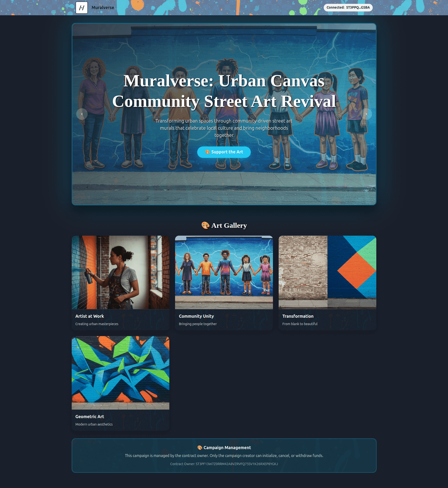

# Urban Canvas: Community Street Art Revival

<div align="center">
  
</div>

A vibrant, community-driven fundraising platform built on Stacks blockchain for the **Urban Canvas: Community Street Art Revival** campaign. This project transforms the Hiro Platform fundraising template into an immersive street art experience that celebrates community creativity and urban transformation.

## 🎨 Project Overview

**Urban Canvas: Community Street Art Revival** is a transformative initiative that brings vibrant street art murals to downtown spaces, revitalizing urban environments and fostering community pride. This project goes beyond simple beautification – it's about creating meaningful connections between artists, residents, and the spaces they share.

### 🌟 Campaign Details
- **Funding Goal**: $15,000 USD
- **Duration**: 90 days
- **Beneficiary**: Downtown Arts Collective
- **Campaign Type**: Street Art Mural Project
- **Theme**: Urban Revitalization through Community Art

### 🎯 Key Features
- **Artist Voting System**: Community-driven mural design selection
- **Funding Breakdown**: Transparent allocation of funds
- **Project Timeline**: 12-week roadmap with specific milestones
- **Community Engagement**: Interactive elements for neighborhood participation
- **Street Art Aesthetic**: Vibrant colors, graffiti typography, urban textures

## 🚀 Getting Started

### Prerequisites
- Node.js 18+ and npm
- Hiro Platform account
- Stacks blockchain knowledge (basic)

### Development Setup

1. **Clone the Repository**
```bash
git clone https://github.com/gorkemsandikci/muralverse-dapp-on-stacks
cd muralverse-dapp-on-stacks
```

2. **Install Dependencies**
```bash
npm install
cd front-end
npm install
```

3. **Environment Configuration**
```bash
cp front-end/.env.example front-end/.env
```

Add your Hiro Platform API key to `front-end/.env`:
```bash
NEXT_PUBLIC_PLATFORM_HIRO_API_KEY=your-api-key-here
```

4. **Start Development Server**
```bash
npm run dev
```

Visit `http://localhost:3000` to view your street art fundraising platform.

## 🔗 Contract & Network Information

### Smart Contract Details
- **Contract Name**: `fundraising-v2`
- **Language**: Clarity
- **Network**: Testnet (ready for mainnet)
- **Contract Owner**: Campaign creator (deployer)

### Network Configuration
```bash
# Testnet
NEXT_PUBLIC_STACKS_NETWORK=testnet
NEXT_PUBLIC_CONTRACT_DEPLOYER_TESTNET_ADDRESS=STC9JV90Q6FVYTBWSH4NNZX32CTSG82JFQ4

# Mainnet (when deployed)
NEXT_PUBLIC_STACKS_NETWORK=mainnet
NEXT_PUBLIC_CONTRACT_DEPLOYER_MAINNET_ADDRESS=your-mainnet-address
```

### Devnet Wallets (for testing)
```bash
# Deployer Wallet (Admin)
STC9JV90Q6FVYTBWSH4NNZX32CTSG82JFQ4

# Test Wallets
ST1SJ3DTE5DN7X54YDH5D64R3BCB6A2AG2ZQ8YPD5
ST2CY5V39NHDPWSXMW9QDT3HC3GD6Q6XX4CFRK9AG
ST2JHG361ZXG51QTKY2NQCVBPPRRE2KZB1HR05NNC
ST2NEB84ASENDXKYGJPQW86YXQCEFEX2ZQPG87ND
ST2REHHS5J3CERCRBEPMGH7921Q6PYKAADT7JP2VB
```

## 🎨 Customization Guide

### Campaign Configuration

Edit `front-end/src/constants/campaign.ts` to customize:
- Campaign title and description
- Funding goal and duration
- Theme colors and styling
- Campaign milestones and features

### Campaign Content

Update `front-end/public/campaign-details.md` with:
- Project overview and mission
- Funding breakdown details
- Timeline and milestones
- Team information
- Community impact statements

### Visual Assets

Add campaign images to `front-end/public/campaign/`:
- Artist portfolio images
- Mural design concepts
- Community photos
- Urban texture backgrounds

### Theme Customization

Modify `front-end/src/theme.ts` for:
- Street art color palette
- Custom fonts (Permanent Marker, Creepster)
- Button variants and hover effects
- Progress bar styling

## 🏗️ Smart Contract Architecture

### `fundraising.clar`
The core Clarity smart contract that handles:
- **Campaign Management**: Initialization, cancellation, and withdrawal
- **Donation Processing**: STX and sBTC acceptance with individual tracking
- **Security Controls**: Admin-only functions with proper authorization
- **Fund Management**: Transparent allocation and beneficiary withdrawal
- **Refund System**: Campaign cancellation with donor refunds

### Key Functions
```clarity
;; Admin Functions (Contract Owner Only)
(define-public (initialize-campaign (goal uint) (duration uint))
(define-public (cancel-campaign)
(define-public (withdraw)

;; Public Functions
(define-public (donate-stx (amount uint))
(define-public (donate-sbtc (amount uint))
(define-public (refund)

;; Read-Only Functions
(define-read-only (get-campaign-info)
(define-read-only (get-stx-donation (donor principal))
(define-read-only (get-sbtc-donation (donor principal))
```

### Security Features
- **Owner Verification**: Only contract deployer can manage campaign
- **Single Initialization**: Campaign can only be started once
- **Proper Authorization**: All admin functions require owner verification
- **Safe Withdrawals**: Funds only accessible to beneficiary after campaign ends

## 🧪 Testing & Development

### Devnet Testing
1. **Start Hiro Platform Devnet**
   - Log into [Hiro Platform](https://platform.hiro.so)
   - Navigate to your project and start Devnet
   - Copy your API key from the Devnet Stacks API URL

2. **Test Smart Contract Functions**
   - Select the Devnet tab in Platform dashboard
   - Click "Interact with Devnet" → "Call functions"
   - Test campaign initialization, donations, and withdrawals
   - Use pre-funded devnet wallets for testing

3. **Frontend Integration Testing**
   - Ensure Devnet is running
   - Start frontend with `npm run dev`
   - Test donation flow, voting system, and UI interactions
   - Verify blockchain transactions in Devnet dashboard

### Test Wallets & Balances
```bash
# Deployer Wallet (Admin)
Address: STC9JV90Q6FVYTBWSH4NNZX32CTSG82JFQ4
Balance: 100,000 STX + 1,000 sBTC (devnet)

# Test Donor Wallets
ST1SJ3DTE5DN7X54YDH5D64R3BCB6A2AG2ZQ8YPD5
ST2CY5V39NHDPWSXMW9QDT3HC3GD6Q6XX4CFRK9AG
ST2JHG361ZXG51QTKY2NQCVBPPRRE2KZB1HR05NNC
```

### Testing Scenarios
- ✅ **Campaign Initialization**: Admin sets goal and duration
- ✅ **STX Donations**: Users contribute STX tokens
- ✅ **sBTC Donations**: Users contribute Bitcoin on Stacks
- ✅ **Admin Controls**: Owner can cancel and withdraw
- ✅ **Refund System**: Donors get refunds if campaign cancelled
- ✅ **Security**: Non-admin users cannot access admin functions

## 🌈 Street Art Theme Features

### Visual Design
- **Color Palette**: Electric Blue (#00D4FF), Vibrant Orange (#FF6B35), Neon Green (#39FF14), Deep Purple (#6A0DAD)
- **Typography**: Graffiti-style fonts (Permanent Marker, Creepster)
- **Animations**: Paint drip effects, spray paint animations, neon glow
- **Layout**: Urban textures, paint splatter backgrounds, polaroid-style cards

### Interactive Elements
- **Progress Tracker**: Paint can filling animation with street art colors
- **Funding Breakdown**: Interactive cards with hover effects
- **Campaign Timeline**: Visual milestone tracking
- **Artist Voting**: Community-driven selection interface

### Community Engagement
- **Voting System**: Real-time artist and design selection
- **Progress Updates**: Visual feedback on campaign milestones
- **Social Sharing**: Community photo and story integration
- **Neighborhood Input**: Location-based feedback collection

## 📱 User Experience

### Mobile Responsiveness
- Thumb-friendly voting buttons
- Responsive grid layouts
- Adaptive typography scaling
- Touch-optimized interactions

### Accessibility
- High contrast ratios despite vibrant colors
- Screen reader friendly content
- Keyboard navigation support
- Reduced motion options

### Performance
- Optimized image loading
- Efficient animations
- Fast page transitions
- Progressive enhancement

## 🚀 Deployment

### Testnet Deployment
1. **Get Test STX**: Visit [Stacks Testnet Faucet](https://explorer.hiro.so/sandbox/faucet?chain=testnet)
2. **Update Environment**: Set `NEXT_PUBLIC_STACKS_NETWORK=testnet`
3. **Deploy Contract**: Use Clarinet or Hiro Platform to deploy `fundraising.clar`
4. **Initialize Campaign**: Call `initialize-campaign` function with goal amount
5. **Test Functions**: Verify donations, withdrawals, and admin controls

### Mainnet Launch
1. **Prepare STX**: Ensure sufficient STX for deployment costs (~50-100 STX)
2. **Update Config**: Set `NEXT_PUBLIC_STACKS_NETWORK=mainnet`
3. **Deploy Contracts**: Deploy through Hiro Platform or Clarinet
4. **Update Frontend**: Set mainnet contract addresses
5. **Launch**: Begin accepting real donations

### Contract Deployment Commands
```bash
# Using Clarinet
clarinet contract publish fundraising-v2

# Using Hiro Platform
# Upload fundraising.clar through Platform dashboard
```

## 🔧 Technical Stack

### Frontend
- **Framework**: Next.js 15.1.7
- **UI Library**: Chakra UI with custom theme
- **Styling**: CSS-in-JS with street art animations
- **State Management**: React hooks and context

### Blockchain
- **Network**: Stacks blockchain
- **Smart Contracts**: Clarity language
- **Wallet Integration**: Hiro Wallet, Devnet wallets
- **API**: Stacks blockchain API

### Development
- **Language**: TypeScript
- **Build Tool**: Next.js build system
- **Package Manager**: npm
- **Code Quality**: ESLint, TypeScript compiler

## ⚙️ Environment Configuration

### Required Environment Variables
```bash
# Network Configuration
NEXT_PUBLIC_STACKS_NETWORK=testnet|mainnet|devnet

# Hiro Platform API Key
NEXT_PUBLIC_PLATFORM_HIRO_API_KEY=your-api-key-here

# Contract Deployer Addresses
NEXT_PUBLIC_CONTRACT_DEPLOYER_TESTNET_ADDRESS=STC9JV90Q6FVYTBWSH4NNZX32CTSG82JFQ4
NEXT_PUBLIC_CONTRACT_DEPLOYER_MAINNET_ADDRESS=your-mainnet-address

# Devnet Configuration
NEXT_PUBLIC_DEVNET_HOST=platform
```

### Environment Setup by Network
```bash
# For Testnet Development
NEXT_PUBLIC_STACKS_NETWORK=testnet
NEXT_PUBLIC_CONTRACT_DEPLOYER_TESTNET_ADDRESS=STC9JV90Q6FVYTBWSH4NNZX32CTSG82JFQ4

# For Mainnet Production
NEXT_PUBLIC_STACKS_NETWORK=mainnet
NEXT_PUBLIC_CONTRACT_DEPLOYER_MAINNET_ADDRESS=your-deployed-contract-address

# For Local Devnet Testing
NEXT_PUBLIC_STACKS_NETWORK=devnet
NEXT_PUBLIC_PLATFORM_HIRO_API_KEY=your-devnet-api-key
```

## 🏗️ Project Structure

```
muralverse-dapp-on-stacks/
├── clarity/                          # Smart Contracts
│   ├── contracts/
│   │   └── fundraising.clar         # Main fundraising contract
│   ├── tests/
│   │   └── fundraising.test.ts      # Contract tests
│   └── deployments/                 # Deployment configurations
│       └── default.testnet-plan.yaml
├── front-end/                       # Next.js Frontend
│   ├── src/
│   │   ├── components/              # React Components
│   │   │   ├── CampaignDetails.tsx  # Main campaign page
│   │   │   ├── DonationModal.tsx    # Donation interface
│   │   │   ├── CampaignAdminControls.tsx # Admin controls
│   │   │   ├── Navbar.tsx          # Navigation
│   │   │   └── StyledMarkdown.tsx  # Markdown renderer
│   │   ├── constants/               # Configuration
│   │   │   ├── campaign.ts         # Campaign settings
│   │   │   └── contracts.ts        # Contract addresses
│   │   ├── hooks/                   # Custom React hooks
│   │   ├── lib/                     # Utility functions
│   │   └── theme.ts                 # Chakra UI theme
│   ├── public/                      # Static assets
│   │   ├── images/                  # Campaign images
│   │   └── campaign-details.md      # Campaign content
│   └── package.json                 # Dependencies
└── README.md                         # This file
```

## 🤝 Contributing

### Development Workflow
1. Fork the repository
2. Create a feature branch
3. Make your changes
4. Test thoroughly in Devnet
5. Submit a pull request

### Code Standards
- Follow TypeScript best practices
- Maintain street art aesthetic consistency
- Ensure mobile responsiveness
- Include accessibility features
- Use English for all code and comments

## 📋 Project Roadmap

### Phase 1: Foundation ✅
- [x] Campaign setup and configuration
- [x] Basic fundraising functionality
- [x] Street art theme integration
- [x] Community voting system

### Phase 2: Enhancement 🚧
- [ ] Advanced animations and effects
- [ ] Social media integration
- [ ] Community photo sharing
- [ ] Artist portfolio galleries

### Phase 3: Expansion 📅
- [ ] Multi-campaign support
- [ ] Advanced analytics
- [ ] Mobile app development
- [ ] International localization

## 🆘 Support & Resources

### Documentation
- [Hiro Platform Documentation](https://docs.hiro.so/)
- [Stacks Documentation](https://docs.stacks.co/)
- [Clarity Language Reference](https://docs.stacks.co/write-smart-contracts/overview)

### Community
- [Stacks Discord](https://discord.gg/stacks)
- [Hiro Community](https://community.hiro.so/)
- [GitHub Issues](https://github.com/hirosystems/platform-template-fundraising-dapp/issues)

### Tools
- [Stacks Explorer](https://explorer.hiro.so/)
- [Clarity Tools](https://clarity.tools/)
- [Stacks Wallet](https://www.hiro.so/wallet)

## ⚠️ Important Notes

### Security
- Smart contracts are for educational purposes
- Not audited for production use
- Test thoroughly before mainnet deployment
- Follow security best practices

### Legal
- Ensure compliance with local regulations
- Verify fundraising requirements
- Consult legal professionals if needed
- Understand tax implications

## 📄 License

This project is licensed under the MIT License - see the [LICENSE](LICENSE) file for details.

## 🙏 Acknowledgments

- **Hiro Systems** for the fundraising template and platform
- **Stacks Foundation** for blockchain infrastructure and Clarity language
- **Downtown Arts Collective** for project inspiration and community vision
- **Community artists** for creative vision and urban transformation
- **Stacks Community** for support and feedback

## 📞 Support & Contact

- **GitHub Issues**: [Report bugs or request features](https://github.com/gorkemsandikci/muralverse-dapp-on-stacks/issues)
- **Documentation**: [Stacks Documentation](https://docs.stacks.co/)
- **Community**: [Stacks Discord](https://discord.gg/stacks)

---

**Urban Canvas: Community Street Art Revival** - Transforming spaces, building community, one mural at a time. 🎨✨

*Built with ❤️ on Stacks blockchain*

---

<div align="center">
  <sub>Made with ❤️ by the Muralverse team</sub><br>
  <sub>Powered by <a href="https://www.stacks.co/">Stacks</a> and <a href="https://www.hiro.so/">Hiro</a></sub>
</div>
