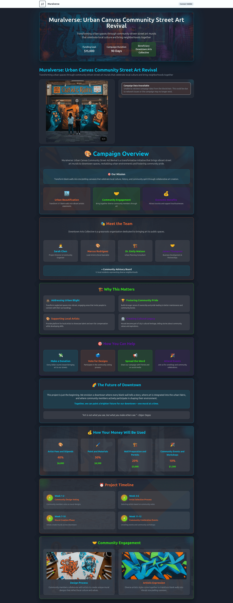

# Urban Canvas: Community Street Art Revival

<div align="center">
  
</div>

A vibrant, community-driven fundraising platform built on Stacks blockchain for the **Urban Canvas: Community Street Art Revival** campaign. This project transforms the Hiro Platform fundraising template into an immersive street art experience that celebrates community creativity and urban transformation.

## 🎨 Project Overview

**Urban Canvas: Community Street Art Revival** is a transformative initiative that brings vibrant street art murals to downtown spaces, revitalizing urban environments and fostering community pride. This project goes beyond simple beautification – it's about creating meaningful connections between artists, residents, and the spaces they share.

### 🌟 Campaign Details
- **Funding Goal**: $15,000 USD
- **Duration**: 90 days
- **Beneficiary**: Downtown Arts Collective
- **Campaign Type**: Street Art Mural Project
- **Theme**: Urban Revitalization through Community Art

### 🎯 Key Features
- **Artist Voting System**: Community-driven mural design selection
- **Funding Breakdown**: Transparent allocation of funds
- **Project Timeline**: 12-week roadmap with specific milestones
- **Community Engagement**: Interactive elements for neighborhood participation
- **Street Art Aesthetic**: Vibrant colors, graffiti typography, urban textures

## 🚀 Getting Started

### Prerequisites
- Node.js 18+ and npm
- Hiro Platform account
- Stacks blockchain knowledge (basic)

### Development Setup

1. **Clone the Repository**
```bash
git clone https://github.com/gorkemsandikci/muralverse-dapp-on-stacks
cd fundraising-dapp-on-stacks
```

2. **Install Dependencies**
```bash
npm install
cd front-end
npm install
```

3. **Environment Configuration**
```bash
cp front-end/.env.example front-end/.env
```

Add your Hiro Platform API key to `front-end/.env`:
```bash
NEXT_PUBLIC_PLATFORM_HIRO_API_KEY=your-api-key-here
```

4. **Start Development Server**
```bash
npm run dev
```

Visit `http://localhost:3000` to view your street art fundraising platform.

## 🎨 Customization Guide

### Campaign Configuration

Edit `front-end/src/constants/campaign.ts` to customize:
- Campaign title and description
- Funding goal and duration
- Theme colors and styling
- Campaign milestones and features

### Campaign Content

Update `front-end/public/campaign-details.md` with:
- Project overview and mission
- Funding breakdown details
- Timeline and milestones
- Team information
- Community impact statements

### Visual Assets

Add campaign images to `front-end/public/campaign/`:
- Artist portfolio images
- Mural design concepts
- Community photos
- Urban texture backgrounds

### Theme Customization

Modify `front-end/src/theme.ts` for:
- Street art color palette
- Custom fonts (Permanent Marker, Creepster)
- Button variants and hover effects
- Progress bar styling

## 🏗️ Smart Contract Architecture

### `fundraising.clar`
The core Clarity smart contract that handles:
- Campaign initialization with USD funding goals
- STX and sBTC donation acceptance
- Individual contribution tracking
- Fund withdrawal for beneficiaries
- Campaign cancellation and refunds

### Key Functions
- `initialize-campaign`: Set up fundraising parameters
- `contribute-stx`: Accept STX donations
- `contribute-sbtc`: Accept sBTC donations
- `withdraw-funds`: Beneficiary fund withdrawal
- `cancel-campaign`: Cancel and refund donations

## 🧪 Testing with Devnet

### 1. Start Hiro Platform Devnet
1. Log into [Hiro Platform](https://platform.hiro.so)
2. Navigate to your project and start Devnet
3. Copy your API key from the Devnet Stacks API URL

### 2. Test Smart Contract Functions
1. Select the Devnet tab in Platform dashboard
2. Click "Interact with Devnet" → "Call functions"
3. Test campaign initialization, donations, and withdrawals
4. Use pre-funded devnet wallets for testing

### 3. Frontend Integration Testing
1. Ensure Devnet is running
2. Start frontend with `npm run dev`
3. Test donation flow, voting system, and UI interactions
4. Verify blockchain transactions in Devnet dashboard

## 🌈 Street Art Theme Features

### Visual Design
- **Color Palette**: Electric Blue (#00D4FF), Vibrant Orange (#FF6B35), Neon Green (#39FF14), Deep Purple (#6A0DAD)
- **Typography**: Graffiti-style fonts (Permanent Marker, Creepster)
- **Animations**: Paint drip effects, spray paint animations, neon glow
- **Layout**: Urban textures, paint splatter backgrounds, polaroid-style cards

### Interactive Elements
- **Progress Tracker**: Paint can filling animation with street art colors
- **Funding Breakdown**: Interactive cards with hover effects
- **Campaign Timeline**: Visual milestone tracking
- **Artist Voting**: Community-driven selection interface

### Community Engagement
- **Voting System**: Real-time artist and design selection
- **Progress Updates**: Visual feedback on campaign milestones
- **Social Sharing**: Community photo and story integration
- **Neighborhood Input**: Location-based feedback collection

## 📱 User Experience

### Mobile Responsiveness
- Thumb-friendly voting buttons
- Responsive grid layouts
- Adaptive typography scaling
- Touch-optimized interactions

### Accessibility
- High contrast ratios despite vibrant colors
- Screen reader friendly content
- Keyboard navigation support
- Reduced motion options

### Performance
- Optimized image loading
- Efficient animations
- Fast page transitions
- Progressive enhancement

## 🚀 Deployment

### Testnet Deployment
1. Get test STX from [Stacks Testnet Faucet](https://explorer.hiro.so/sandbox/faucet?chain=testnet)
2. Update environment variables for testnet
3. Deploy contracts through Hiro Platform
4. Test with real network conditions

### Mainnet Launch
1. Ensure sufficient STX for deployment costs
2. Update deployment configuration for mainnet
3. Deploy contracts through Platform dashboard
4. Update frontend environment variables
5. Launch and begin processing real transactions

## 🔧 Technical Stack

### Frontend
- **Framework**: Next.js 15.1.7
- **UI Library**: Chakra UI with custom theme
- **Styling**: CSS-in-JS with street art animations
- **State Management**: React hooks and context

### Blockchain
- **Network**: Stacks blockchain
- **Smart Contracts**: Clarity language
- **Wallet Integration**: Hiro Wallet, Devnet wallets
- **API**: Stacks blockchain API

### Development
- **Language**: TypeScript
- **Build Tool**: Next.js build system
- **Package Manager**: npm
- **Code Quality**: ESLint, TypeScript compiler

## 🤝 Contributing

### Development Workflow
1. Fork the repository
2. Create a feature branch
3. Make your changes
4. Test thoroughly in Devnet
5. Submit a pull request

### Code Standards
- Follow TypeScript best practices
- Maintain street art aesthetic consistency
- Ensure mobile responsiveness
- Include accessibility features

## 📋 Project Roadmap

### Phase 1: Foundation ✅
- [x] Campaign setup and configuration
- [x] Basic fundraising functionality
- [x] Street art theme integration
- [x] Community voting system

### Phase 2: Enhancement 🚧
- [ ] Advanced animations and effects
- [ ] Social media integration
- [ ] Community photo sharing
- [ ] Artist portfolio galleries

### Phase 3: Expansion 📅
- [ ] Multi-campaign support
- [ ] Advanced analytics
- [ ] Mobile app development
- [ ] International localization

## 🆘 Support & Resources

### Documentation
- [Hiro Platform Documentation](https://docs.hiro.so/)
- [Stacks Documentation](https://docs.stacks.co/)
- [Clarity Language Reference](https://docs.stacks.co/write-smart-contracts/overview)

### Community
- [Stacks Discord](https://discord.gg/stacks)
- [Hiro Community](https://community.hiro.so/)
- [GitHub Issues](https://github.com/hirosystems/platform-template-fundraising-dapp/issues)

### Tools
- [Stacks Explorer](https://explorer.hiro.so/)
- [Clarity Tools](https://clarity.tools/)
- [Stacks Wallet](https://www.hiro.so/wallet)

## ⚠️ Important Notes

### Security
- Smart contracts are for educational purposes
- Not audited for production use
- Test thoroughly before mainnet deployment
- Follow security best practices

### Legal
- Ensure compliance with local regulations
- Verify fundraising requirements
- Consult legal professionals if needed
- Understand tax implications

## 📄 License

This project is licensed under the MIT License - see the [LICENSE](LICENSE) file for details.

## 🙏 Acknowledgments

- **Hiro Systems** for the fundraising template
- **Stacks Foundation** for blockchain infrastructure
- **Downtown Arts Collective** for project inspiration
- **Community artists** for creative vision

---

**Urban Canvas: Community Street Art Revival** - Transforming spaces, building community, one mural at a time. 🎨✨

*Built with ❤️ on Stacks blockchain*
